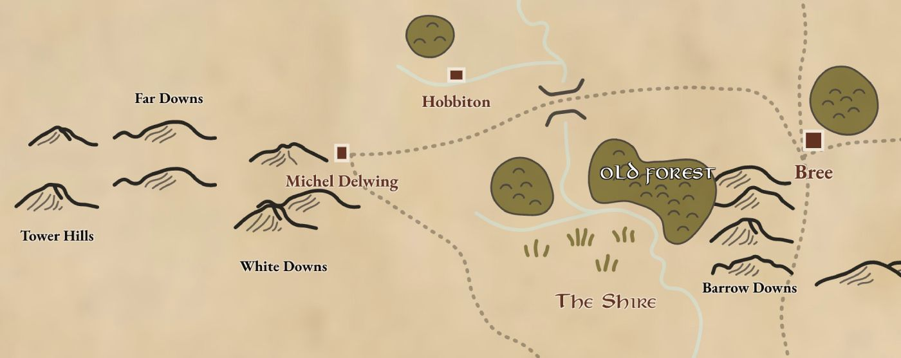

# Middle-Earth interactive map

This project aims to provide an **interactive map of Middle-Earth** as **imagined by J.R.R. Tolkien** in his books.  
All points of interest were collected on various representations of Middle-Earth existing maps.



## Credits

- Map drawn in Figma with custom terrain & landmark elements.
- Button's icons: extracted from [Remix Icon collection](https://remixicon.com/).
- Favicon: [One Ring](https://icons8.com/icon/20169/one-ring) icon by [Icons8](https://icons8.com).
- Map texture overlay: [Image by rawpixel.com on Freepik](https://www.freepik.com/free-ai-image/wooden-floor-background_4100933.htm#fromView=keyword&page=1&position=0&uuid=cb06f3fd-0006-4ddd-93a7-8622848f46be&query=Old+Map+Texture).
- Compass rose (modified): [Image by freepik](https://www.freepik.com/free-vector/hand-drawn-map-compass-background_1582142.htm#fromView=search&page=1&position=23&uuid=90506e90-3cbb-4891-bf73-4316a0f28b13&query=compass+rose).

## Contribute

Feel free to open an issue or contribute if you'd like anything fixed or added.

## Development

In order to work with this project, you will need to serve the `index.html` with a http server like [serve](https://www.npmjs.com/package/serve) or [live-server](https://www.npmjs.com/package/live-server).

You can globally install these packages.

### Installation

```shell
# serve
npm install -g serve

# or live-server
npm install -g live-server
```

### Usage

In the cloned repository, run the following commands:

```shell
# with serve
serve .

# or with live-server
live-server .
```
