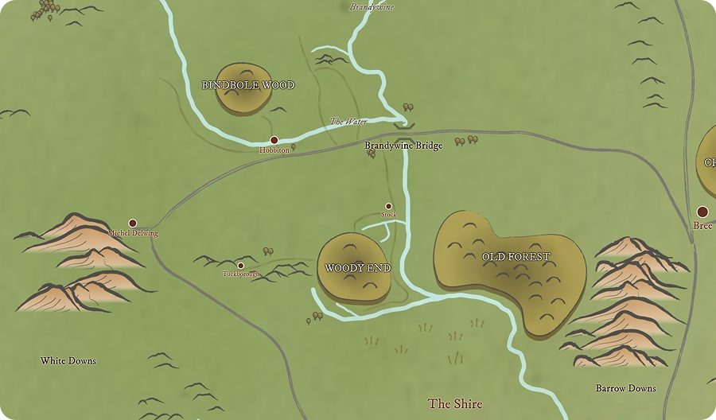

# Middle-Earth interactive map

This project aims to provide an **interactive map of Middle-earth** at the end of the Third Age as **imagined by J.R.R. Tolkien** in his books.

[Open Middle-earth map](https://middle-earth.jeantinland.com).

You can follow [this journal](https://www.jeantinland.com/journal/lotr/) to see the development and creation process of the map.



> [!NOTE]
> Zoom level, map center and rotation are preserved in the URL, so you can share a specific view of the map by sharing the URL.

**Notice: As I am working simultaneously on a lot of projects, things here may seem to move slowly but they are still in progress. I'm always monitoring my notifications and messages, so if you have any questions or want to chat about anything, feel free [to reach out](https://www.jeantinland.com/contact/)!**

## Credits

- Map drawn in Figma with custom terrain & landmark elements.
- Notable places drawing created by myself in Figma. They are inspired by the movie trilogy and various representation of existing Middle-Earth paintings and artworks:
  - Tharbad is drawn based on Rob Alexander's painting of the city: [Tharbad](https://tolkiengateway.net/wiki/Tharbad#/media/File:Rob_Alexander_-_The_Ruins_of_Tharbad.jpg).
  - Tower Hill is drawn based on the painting of the same place by Nasmith Elostirion: [Tower Hill](https://lotr.fandom.com/wiki/Tower_Hills?file=Nasmith_elostirion.jpg).
- Points of interest have been collected from various sources, including:
  - Original maps by J.R.R. Tolkien and his son Christopher Tolkien.
  - **The Atlas of Middle-earth** by Karen Wynn Fonstad.
  - **MERP maps** by various artists.
- Button's icons: extracted from [Remix Icon collection](https://remixicon.com/).
- Favicon: [One Ring](https://icons8.com/icon/20169/one-ring) icon by [Icons8](https://icons8.com).
- Map texture overlay: [Image by rawpixel.com on Freepik](https://www.freepik.com/free-ai-image/wooden-floor-background_4100933.htm#fromView=keyword&page=1&position=0&uuid=cb06f3fd-0006-4ddd-93a7-8622848f46be&query=Old+Map+Texture).
- Compass rose (modified): [Image by freepik](https://www.freepik.com/free-vector/hand-drawn-map-compass-background_1582142.htm#fromView=search&page=1&position=23&uuid=90506e90-3cbb-4891-bf73-4316a0f28b13&query=compass+rose).
- Font: [IM Fell DW Pica](https://fonts.google.com/specimen/IM+Fell+DW+Pica)

> [!NOTE]
> Places from all sources are displayed by default, but you can filter them and display only "canon" places from the map nomenclature at the top left of the screen.

## Contribute

Feel free to open an issue or contribute if you'd like anything fixed or added.

If you want to propose a new point of interest, or correct an existing one, you can retrieve the position of the point on the map by adding `?debug=true` to the URL, then click on the map to get the coordinates of the point in your clipboard.

## Development

This project includes [live-server](https://www.npmjs.com/package/live-server) as dev dependencies to serve the map locally and [sharp](https://sharp.pixelplumbing.com/) for image processing.

**Otherwise, it is a standalone app without any dependency at runtime.**

### Setup

First, install the project dependencies with `bun` or `npm`:

```shell
# with bun
bun install

# or with npm
npm install
```

### Running the Server Locally

You can run the development server using `live-server`:

```shell
# with bun
bun dev

# or with npm
npm dev
```

The server will start and you can access the map by opening the URL shown in your terminal : `http://localhost:3000`.

### Generating Map Tiles

To generate map tiles from the source images, run:

```shell
# with bun
bun generate-tiles

# or with npm
npm run generate-tiles
```

This script uses [sharp](https://sharp.pixelplumbing.com/) to process map images at different zoom levels, split them into tiles of 512x512 pixels, and apply a paper texture overlay.
